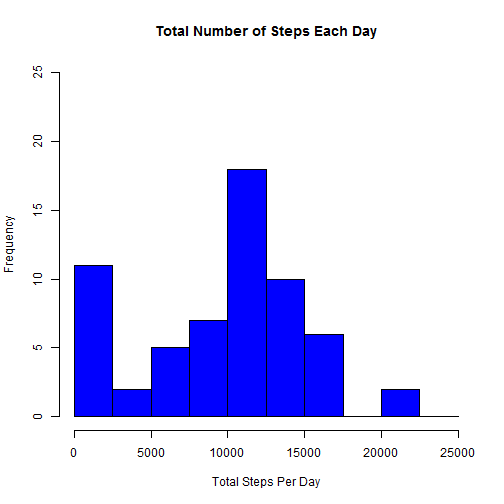
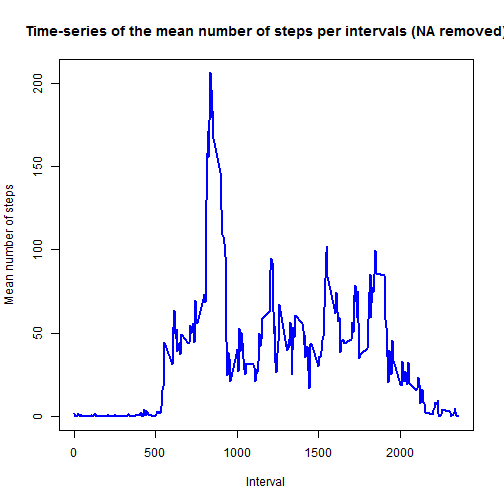
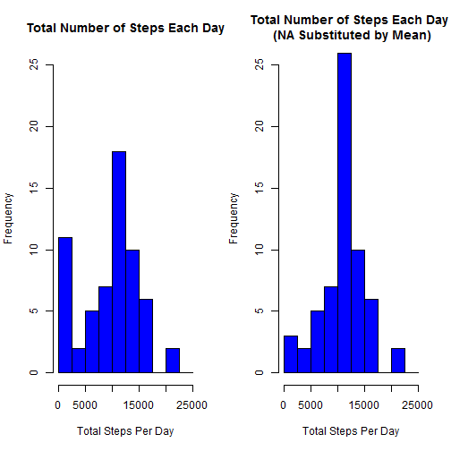
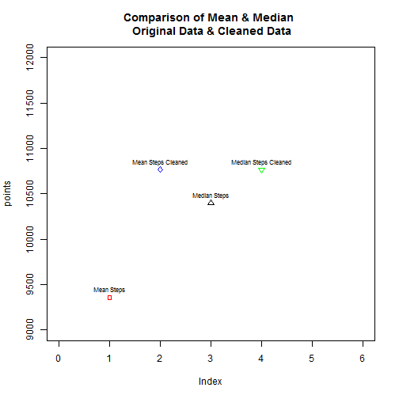
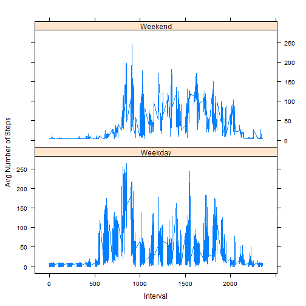

##Load the required Libraries


#1.Loading and preprocessing the data

##Load the data (i.e. read.csv())


```r
activityData <- read.csv("repdata_data_activity/activity.csv", stringsAsFactors = F)
```

##Process/transform the data (if necessary) into a format suitable for your analysis


```r
# Convert the date column which is in String format to POSIX date format
activityData$date <- as.POSIXct(activityData$date, format = "%Y-%m-%d")
```

#2.What is mean total number of steps taken per day? 

##Calculate the total number of steps taken per day


```r
totalByDate <- aggregate(x = activityData$steps, by = list(activityData$date), 
    FUN = sum, na.rm = T)
names(totalByDate) <- c("date", "TotalSteps")
```

###Display first Five rows of TotalByDate


```
##         date TotalSteps
## 1 2012-10-01          0
## 2 2012-10-02        126
## 3 2012-10-03      11352
## 4 2012-10-04      12116
## 5 2012-10-05      13294
## 6 2012-10-06      15420
```

##Make a histogram of the total number of steps taken each day


```r
hist(totalByDate$TotalSteps, col = "blue", breaks = seq(from = 0, to = 25000, 
    by = 2500), xlab = "Total Steps Per Day", ylim = c(0, 25), main = "Total Number of Steps Each Day")
```



##Calculate and report the mean and median of the total number of steps taken per day

```r
meanSteps <- mean(totalByDate$TotalSteps)
medianSteps <- median(totalByDate$TotalSteps)
```
###Display mean & median


```
## [1] 9354.23
```

```
## [1] 10395
```

#3.What is the average daily activity pattern?

##Make a time series plot (i.e. type = "l") of the 5-minute interval (x-axis) and the average number of steps taken, averaged across all days (y-axis)


```r
MeanStepsByInterval <- aggregate(x = activityData$steps, by = list(activityData$interval), 
    FUN = mean, na.rm = T)

names(MeanStepsByInterval) <- c("Interval", "MeanSteps")

plot(MeanStepsByInterval$Interval, MeanStepsByInterval$MeanSteps, type = "l", 
    col = "blue", lwd = 2, xlab = "Interval", ylab = "Mean number of steps", 
    main = "Time-series of the mean number of steps per intervals (NA removed)")
```



##Which 5-minute interval, on average across all the days in the dataset, contains the maximum number of steps?


```r
max_mean_steps_index = which(MeanStepsByInterval$MeanSteps == max(MeanStepsByInterval$MeanSteps))
```

###Display 


```r
MeanStepsByInterval[max_mean_steps_index, 1]
```

```
## [1] 835
```

#4.Imputing missing values

##Calculate and report the total number of missing values in the dataset (i.e. the total number of rows with NAs)


```r
Number_of_NA <- sum(is.na(activityData$steps))
```

###Display Total Number of missing values 


```r
Number_of_NA
```

```
## [1] 2304
```

##Devise a strategy for filling in all of the missing values in the dataset. The strategy does not need to be sophisticated. For example, you could use the mean/median for that day, or the mean for that 5-minute interval, etc.

##Create a new dataset that is equal to the original dataset but with the missing data filled in


```r
activityDataCleaned <- activityData
activityDataCleaned$steps <- impute(activityDataCleaned$steps, fun = mean)
```

###Display first 5 rows of NA Cleaned Data Data Set 


```r
head(activityDataCleaned)
```

```
##     steps       date interval
## 1 37.3826 2012-10-01        0
## 2 37.3826 2012-10-01        5
## 3 37.3826 2012-10-01       10
## 4 37.3826 2012-10-01       15
## 5 37.3826 2012-10-01       20
## 6 37.3826 2012-10-01       25
```

##Make a histogram of the total number of steps taken each day and Calculate and report the mean and median total number of steps taken per day. Do these values differ from the estimates from the first part of the assignment? What is the impact of imputing missing data on the estimates of the total daily number of steps?


```r
totalByDateClened <- aggregate(x = activityDataCleaned$steps, by = list(activityDataCleaned$date), 
    FUN = sum, na.rm = T)
names(totalByDateClened) <- c("date", "TotalSteps")
```

###Display first five rows of totalByDateClened


```
##         date TotalSteps
## 1 2012-10-01   10766.19
## 2 2012-10-02     126.00
## 3 2012-10-03   11352.00
## 4 2012-10-04   12116.00
## 5 2012-10-05   13294.00
## 6 2012-10-06   15420.00
```


```r
par(mfrow = c(1, 2))

hist(totalByDate$TotalSteps, col = "blue", breaks = seq(from = 0, to = 25000, 
    by = 2500), xlab = "Total Steps Per Day", ylim = c(0, 25), main = "Total Number of Steps Each Day")
hist(totalByDateClened$TotalSteps, col = "blue", breaks = seq(from = 0, to = 25000, 
    by = 2500), xlab = "Total Steps Per Day", ylim = c(0, 25), main = "Total Number of Steps Each Day \n (NA Substituted by Mean)")
```



>**Conclusion:**_From the above plot , comparing the frequency distributions of Raw data & NA Cleaned Data . We could conclude that , there is increase in frequencies in 10000-12500 from 17 to 26 . Othere than that most of the other ranges are more or less equal._ 

## Comparison of Mean & Median between Raw and NA Substituted Data Sets


```r
# Calculate Mean and Median of Cleaned Data Set
meanStepsCleaned <- mean(totalByDateClened$TotalSteps)
medianStepsCleaned <- median(totalByDateClened$TotalSteps)

# Create a Vector of Mean & Median from both Raw and Cleaned Data sets
points <- c(meanSteps, meanStepsCleaned, medianSteps, medianStepsCleaned)
names(points) <- c("Mean Steps", "Mean Steps Cleaned", "Median Steps", "Median Steps Cleaned")

# Plot all 4 points to compare them
par(mfrow = c(1, 1))
plot(points, ylim = c(9000, 12000), xlim = c(0, 6), pch = c(22, 23, 24, 25), 
    col = c("red", "blue", "black", "green"), main = "Comparison of Mean & Median \n Original Data & Cleaned Data")
text(points, names(points), cex = 0.7, pos = 3)
```



>**Conclusion:**_From the above plot , we can conclude that , both mean and median increased in the NA cleaned data set._ 

#5. Are there differences in activity patterns between weekdays and weekends?

##Create a new factor variable in the dataset with two levels - "weekday" and "weekend" indicating whether a given date is a weekday or weekend day.


```r
activityDataCleaned$weekday <- weekdays(activityDataCleaned$date)
activityDataCleaned$dayType <- ifelse(weekdays(activityDataCleaned$date) %in% 
    c("Sunday", "Saturday"), "Weekend", "Weekday")
```

### Display first 5 rows of Cleaned Data Set (with Weekday & DayType Added)

```r
head(activityDataCleaned)
```

```
##     steps       date interval weekday dayType
## 1 37.3826 2012-10-01        0  Monday Weekday
## 2 37.3826 2012-10-01        5  Monday Weekday
## 3 37.3826 2012-10-01       10  Monday Weekday
## 4 37.3826 2012-10-01       15  Monday Weekday
## 5 37.3826 2012-10-01       20  Monday Weekday
## 6 37.3826 2012-10-01       25  Monday Weekday
```

##Make a panel plot containing a time series plot (i.e. type = "l") of the 5-minute interval (x-axis) and the average number of steps taken, averaged across all weekday days or weekend days (y-axis). 


```r
AvgStepsByDayType <- aggregate(x = activityDataCleaned$steps, by = list(activityDataCleaned$weekday, 
    activityDataCleaned$dayType, activityDataCleaned$interval), mean)

names(AvgStepsByDayType) <- c("Weekday", "DayType", "Interval", "Mean")

xyplot(Mean ~ Interval | DayType, data = AvgStepsByDayType, type = "l", lwd = 1, 
    layout = c(1, 2), xlab = "Interval", ylab = "Avg Number of Steps")
```



>**Conclusion:**_From the above plot we can conclude that , There is a difference in the walking pattern between Weendays & Weekends during the Day time._ 


